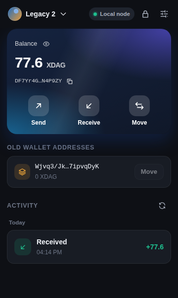
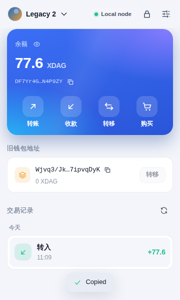
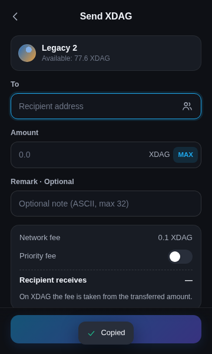

# 藏锋 · Sheath — XDAG 自托管浏览器钱包

**藏锋（Sheath）** 是一个安全、轻快、界面精致的 **XDAG 浏览器插件钱包**（Chrome / Edge / Brave 等 Chromium 内核浏览器，Manifest V3）。
名字取自 XDAG 的旧称 “Dagger（匕首）”——鞘藏锋芒，私钥不出本机。
依据 XDAG 官方代码实现：[xdag](https://github.com/XDagger/xdag)（2018 C 客户端）、[xdagj](https://github.com/XDagger/xdagj) / [xdagj-crypto](https://github.com/XDagger/xdagj-crypto) 与 [XDAG Pro](https://github.com/XDagger/xdag-pro)，**同时兼容新旧两代钱包文件**。

> 社区开发，开源；与 XDagger 官方团队无隶属或背书关系。

<p align="center">
  
  
  
</p>

## 功能

| 类别 | 功能 |
| --- | --- |
| 钱包 | 创建钱包（12 词 BIP39 助记词 + 备份校验）；多账户（HD 派生 `m/44'/586'/0'/0/i`）；账户重命名 / 移除 |
| 导入 | 助记词（12/15/18/21/24 词）· 私钥（hex）· **xdagj `wallet.data`** · **2018 版 `wallet.dat` + `dnet_key.dat`** |
| 旧钱包 | 选择旧钱包文件夹即可从 `storage/` **自动找到 2018 版 32 位旧地址**及余额（与 C 客户端判断“自己的区块”的算法一致），并一键**转移到新地址**（等价于 xdagj `xfertonew`），自动使用拥有该区块的那把密钥 |
| 转账 | 地址校验（Base58Check）、全部金额、备注（ASCII ≤ 32）、加速手续费（参考节点平均手续费）、确认页、对方实收金额预览 |
| 收款 | 二维码、复制地址 |
| 记录 | 交易记录（分页、按日期分组）、待确认交易跟踪、交易详情（状态 / 对手方 / 手续费 / 备注）、区块浏览器链接 |
| 其它 | 地址簿、主网 / 测试网 / 自定义节点（连接测试、链校验）、简体中文 / English、深色 / 浅色 / 跟随系统、隐藏余额 |
| 备份 | 查看助记词、导出私钥、**导出 xdagj 兼容的 `wallet.data`**（可被 xdagj 节点或本插件重新导入） |

## 钱包文件兼容性

| 格式 | 来源 | 支持 |
| --- | --- | --- |
| `wallet.dat`（及 `wallet-testnet.dat`）+ `dnet_key.dat` | 2018 年原版 C 客户端 / Windows XDagWallet | 导入（dfslib 加密算法逐位移植；用 `dnet_key.dat` 校验密码；兼容无密码钱包、ARM 版短密钥） |
| `wallet/wallet.data`（版本 4） | xdagj 节点 | 导入 + 导出（BCrypt(cost 12) → AES-192-CBC；包含助记词与 HD 序号） |
| BIP39 助记词 | xdagj、XDAG Pro | 导入 / 创建（路径 `m/44'/586'/0'/0/i`） |
| 私钥 hex | 所有客户端 | 导入 / 导出 |

地址：新格式为 `Base58Check(RIPEMD160(SHA256(压缩公钥)))`；旧格式为区块哈希的 32 位 Base64。
交易：512 字节区块，与 xdagj `io.xdag.core.Block` **逐字节一致**（账户转账带 nonce；旧区块余额转移使用 `XDAG_FIELD_IN` 且无 nonce）。
详见 [docs/FORMATS.md](docs/FORMATS.md)。

> 2018 旧钱包说明：旧网络中余额记录在“区块地址”上（钱包界面显示的 32 位地址），这个地址无法仅凭私钥算出。选择整个旧钱包文件夹时，插件会在其中的 `storage/` 里找出由你的密钥签名的区块，自动列出旧地址和余额；只选择 `wallet.dat` 时，可手动填入旧地址。

## 安全设计

- **私钥只在后台 Service Worker 中使用**：界面只拿到地址；签名、广播在后台完成。
- **本地加密**：PBKDF2-HMAC-SHA256（600,000 次）派生密钥 + AES-256-GCM 加密整个金库；从不保存明文密码。
- **会话**：解锁后派生密钥只存于 `chrome.storage.session`（仅内存、仅扩展可信上下文），浏览器关闭即清除。
- **自动锁定**：可设置 1 分钟 – 4 小时或从不；系统锁屏时立即锁定；连续输错密码指数退避。
- **签名前校验**：后台再次验证地址、金额、手续费、余额，并用 `xdag_netType` 确认节点所在链与所选网络一致；无法确认时拒绝签名，防止跨链误签。
- **防重复付款**：广播超时或节点应答异常时，交易记为“状态未知”而非“失败”，并提示先核对再重发；节点返回的交易哈希与本地计算值不一致时同样处理。
- **并发安全**：所有金库写入与改密串行执行（改密与其它写入交错不会损坏金库）；锁定后进行中的恢复 / 解锁 / 转账都会作废；密码尝试串行计数，并行猜测无法绕过限速。
- **严格 CSP**（无 `eval`、无远程脚本），无 content script、不向网页注入任何对象；依赖锁定版本。椭圆曲线、哈希、AES、BIP39/32 使用经过审计的 [@noble](https://paulmillr.com/noble/) / [@scure](https://github.com/paulmillr/scure-base) 库；xdagj 所需的 BCrypt 与 2018 钱包的 dfslib 为自行移植，并用官方实现生成的测试向量逐字节比对。
- 敏感信息（助记词、私钥）需再次输入密码才能查看；复制时会提醒粘贴后清空剪贴板。
- 自定义节点仅允许 `https://`（本机 `localhost` 可用 `http://`），并按需申请该域名权限。

## 安装

### 从源码构建

```bash
npm ci
npm run build          # 输出到 dist/
npm run package        # 可选：生成 release/sheath-xdag-wallet-<version>.zip
```

在 Chrome 打开 `chrome://extensions` → 打开“开发者模式” → “加载已解压的扩展程序” → 选择 `dist/` 目录。

### 升级（钱包数据不丢失）

- **从 Chrome 应用商店安装**：Chrome 自动更新，数据保持不变；“设置 → 关于 → 检查更新”可立即检查。
- **手动安装（加载已解压）**：把新版本**解压覆盖到原来的同一个文件夹**，再在 `chrome://extensions` 点该扩展的刷新按钮。数据保存在 Chrome 中、按扩展 ID 区分，手动安装的扩展 ID 由文件夹路径决定，所以同一路径覆盖后数据还在（刷新后钱包会锁定，输入密码即可）。
- **不要“移除”扩展**：移除会删除这个扩展保存的全部数据（加密金库、设置、地址簿）。换到别的文件夹加载也相当于一个新扩展，看不到原来的数据。
- 任何重装之前先备份：助记词（设置 → 显示助记词）、“导出 xdagj wallet.data”，以及原来的 2018 钱包文件 / 私钥。
首次安装会自动打开欢迎页，可创建新钱包或导入已有钱包。

### 上架 Chrome 网上应用店

所需材料已备齐在 [`store/`](store/)：
[上架步骤](store/SUBMISSION.md)、[商店文案与权限说明（可直接粘贴）](store/LISTING.md)、[隐私政策](store/PRIVACY.md)、
[截图与宣传图](store/assets/)（`node scripts/store-assets.mjs` 生成）、[审核用测试钱包文件](store/reviewer-test-files/)。

### 导入 2018 旧钱包

1. 插件中选择“导入钱包 → 2018 旧钱包”，点“选择文件夹”，选中旧客户端目录（例如 `C:\xdag\` 或 XDagWallet 文件夹，里面有 `wallet.dat`、`dnet_key.dat` 和 `storage/`）。文件只在本机读取；Chrome 会弹窗确认。
2. 输入旧钱包密码（没有设置过密码则留空）。
3. 插件自动在 `storage/` 中找出旧地址并查询余额；勾选要添加的账户和旧地址。没有 `storage/` 时，可只选 `wallet.dat` + `dnet_key.dat` 并手动填入 32 位旧地址。已经导入过的钱包再导入一次文件夹，找到的旧地址会补充到原账户上。
4. 首页“旧钱包地址”卡片中点击“转移”，即可把旧区块余额转到新地址（手续费 0.1 XDAG）。标 ⚠ 的旧地址签名格式较早，当前 xdagj 节点可能拒绝转出（节点限制，余额仍在旧地址上）。

## 开发

```bash
npm test               # 单元 / 集成测试（与官方 Java / C 实现的交叉测试向量对比）
npm run typecheck
npm run mock-node      # 本地模拟 xdagj RPC 节点（http://127.0.0.1:18545），用于界面调试
npm run build && npm run e2e   # Playwright 端到端测试（真实加载插件 + 模拟节点）
# e2e 与 scripts/store-assets.mjs 需要 Playwright（不在 package.json 里）：
#   npm i --no-save -D playwright && npx playwright install chromium   （或设置 PLAYWRIGHT_MODULE 指向全局安装）
```

在插件“设置 → 网络 → 添加自定义节点”中填入 `http://127.0.0.1:18545` 即可连接模拟节点；
`FUND=<地址>:<数量>` 环境变量可为模拟节点预置余额。

### 兼容性是如何验证的

`tests/fixtures/` 中的测试向量由**官方代码生成**，而非本项目自己生成：

- `xdagj-vectors.json`：[`tools/vectors/xdagj/VectorGen.java`](tools/vectors/xdagj/VectorGen.java) 调用 xdagj 0.8.3 本身的 `Wallet`、`Block`、BouncyCastle `BCrypt`、`Signer` 等类生成：BIP44 派生、签名、BCrypt、AES、真实 `wallet.data` 文件、签名后的交易区块、金额换算。
- `legacy-vectors.json`：[`tools/vectors/legacy/gen_legacy.c`](tools/vectors/legacy/gen_legacy.c) 链接原版 `dfslib` / `dfsrsa` 源码，按 `dnet_crypt.c` 与 `wallet.c` 的流程生成 `dnet_key.dat` 与 `wallet.dat`（含空密码、中文 / 俄文密码、emoji 密码、ARM 短密钥等边界情况）。
- `legacy-storage/`：[`tools/vectors/legacy/gen_storage.c`](tools/vectors/legacy/gen_storage.c) 链接原版客户端的 `crypt.c`、`hash.c`、`address.c`、`storage.c`，按 `xdag_create_block` 的字段布局生成地址区块、转账区块、矿池首区块、挖矿区块、他人区块和测试网区块，用 `xdag_storage_save` 写成真实的 `storage/` 目录（含损坏文件），并用客户端自己的 `valid_signature` 判定归属。另外也用 goXdagWallet 测试中的真实签名做了交叉验证。

本插件生成的交易区块与 xdagj 生成的结果逐字节比对一致。

### 目录结构

```
src/core/        纯 TypeScript 协议与密码学实现（地址、金额、BIP39/44、BCrypt、xdagj 钱包文件、dfslib 旧钱包、交易区块、金库、RPC）
src/background/  MV3 Service Worker：密钥环、消息路由、自动锁定
src/ui/          Preact 界面（弹窗与完整页面共用），中英文、深浅主题
tests/           Vitest 测试 + 官方实现生成的测试向量
tools/vectors/   测试向量生成器（Java / C）
scripts/         打包、图标、模拟节点、端到端测试
```

---

## English

**Sheath (藏锋)** is a Manifest V3 browser-extension wallet for **XDAG** (community-built, not affiliated with the XDagger team) that opens both **2018 C-client wallets** (`wallet.dat` + `dnet_key.dat`, dfslib cipher ported bit-for-bit) and **xdagj `wallet.data`** (v4, BCrypt + AES-192-CBC), as well as BIP39 phrases (`m/44'/586'/0'/0/i`, compatible with XDAG Pro) and raw private keys.
It signs nonce-based account transfers byte-identical to xdagj's `Block`, can move balances held by 2018 block addresses to the new address format (like xdagj `xfertonew`), and exports an xdagj-compatible `wallet.data`.

Keys live only in the background service worker, the vault is encrypted with PBKDF2-SHA256 (600k) + AES-256-GCM, the session key is kept in RAM-only `chrome.storage.session`, the wallet auto-locks on inactivity and screen lock, and the node's chain is verified before signing.

Build with `npm ci && npm run build`, then load `dist/` via `chrome://extensions` → *Load unpacked*. Run `npm test` for the cross-implementation test suite and `npm run e2e` for the Playwright end-to-end test.

License: MIT (see [LICENSE](LICENSE) for third-party notices).
